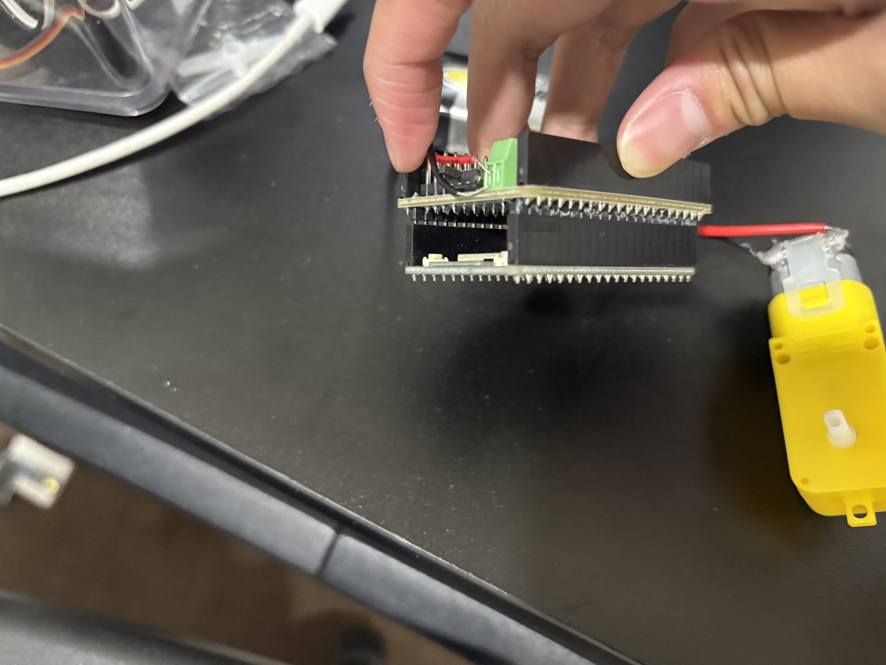
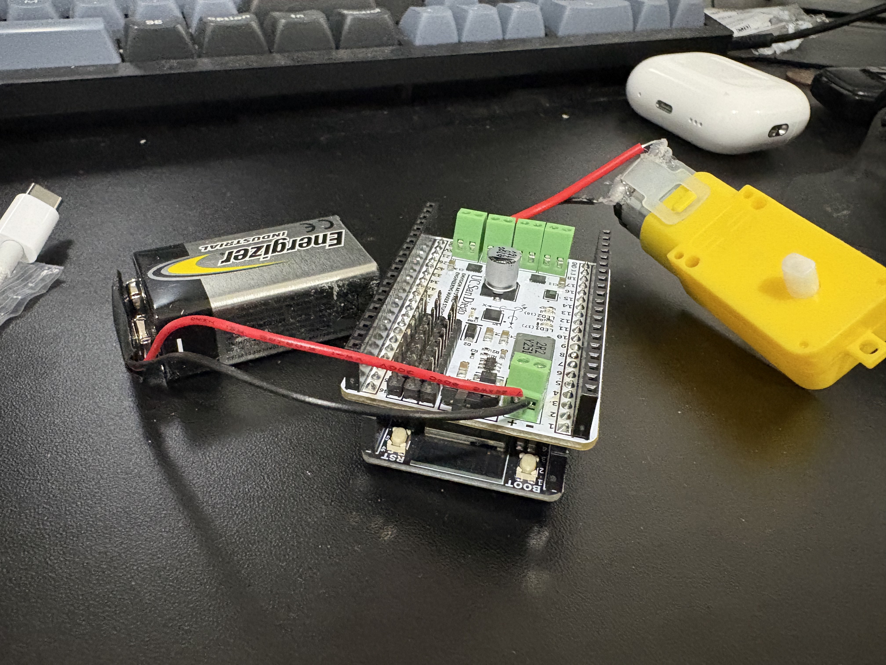
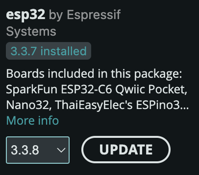
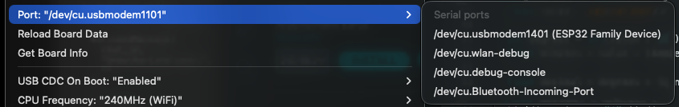
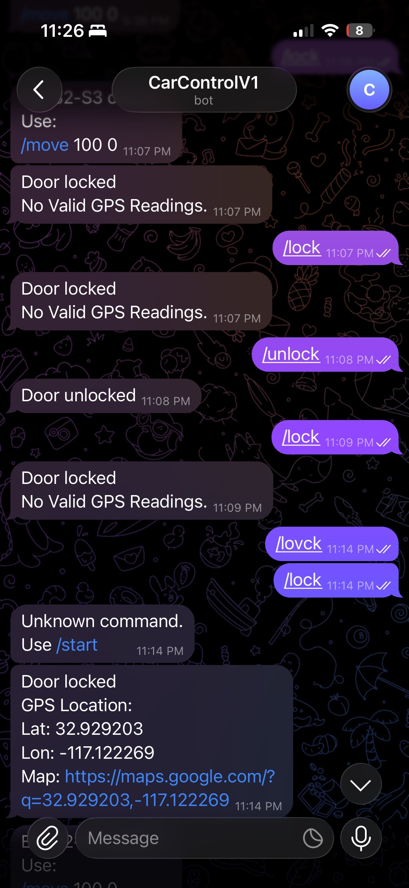

# JknYang-ECE196-MiniProject-3
# Motor Controler via Telegram Bot

## Jackson Yang — ECE 196 SP26


# Brainstorm / Tutorial Ideas

Using telegram botfather to create a bot and connecting the servo to wifi and the bot to allow for code to be sent through. 

# Objectives

- Be able send a /move LOW_NUM HIGH_NUM commands to allow the motor to spin forwards and backwards with a configurable speed.

# Supplies

## Hardware
1. ESP32S3 Dev Board
2. Mini-Project #2 Motor Shield
3. USB-C cord
4. Battery (from Mini-Project #2)
## Software
1. ARDUINO IDE
2. Arduino C
3. **Telegram**
4. Arduino OS

# Intro Concept / Theory

We are using a concept from CSE 124 which is HTTPS, Hypertext Transfer Protocol Secure. HTTPS is a secure encrypted version of HTTP. HTTP is a state-less request-response model, that allows you to send requests to a server to request for data. It's less secure since it transmits data in clear, unencrypted text which allows everyone to be able to access the data. HTTPS goes through 3 different types of protection to secure data, encryption, authentification, and data integrity.

# Hardware Setup

You need to have your ESP32S3 Dev Board and connect the motor shield on like below



Hook up the motor shield to the battery like below



# Firmware

1. First, download and install the Arduino IDE using the following link: https://www.arduino.cc/en/software/
2. Connect your ESP32 and your laptop using the usb-c cable
3. Open up the tool bar and in the dropdown hover over board, and click on board manager and type in ESP32 and download the ESP32 package by Espressif Systems (Version 3.1.1 or higher)



1. Next go to tool bar and press port, for mac users you should be pressing /dev/cu.usbmodem101 (ESP32 family device)



Now you have set the ESP32 up !

# Software

Now like in mini-project #2 try the following code to make sure you have set everything up correct.
```c
const unsigned int LED{17};
// add these
const unsigned int MTR_HI{?};
const unsigned int MTR_LO{?};


void setup() {
   pinMode(LED, OUTPUT);
   // and these
   pinMode(MTR_HI, OUTPUT);
   pinMode(MTR_LO, OUTPUT);


   // configure pins to spin the motor in a direction
   digitalWrite(MTR_HI, HIGH);
   digitalWrite(MTR_LO, LOW);
}

```
Your motor should now be spinning!

# Bot Creation

**Now It's time to create the bot**

1. Open up telegram and search for `botfather` (https://telegram.me/BotFather)
2. Send the command `/newbot` to `botfather` 
3. Name your new bot, your bot should end with a "bot", for example, `creation_bot` 
4. You'll end up with an HTTP API key you can use

You should end up with this message
```txt
Done! Congratulations on your new bot. You will find it at t.me/[bot name]. You can now add a description, about section and profile picture for your bot, see /help for a list of commands. By the way, when you've finished creating your cool bot, ping our Bot Support if you want a better username for it. Just make sure the bot is fully operational before you do this.

Use this token to access the HTTP API:
[HTTP API]
Keep your token secure and store it safely, it can be used by anyone to control your bot.

For a description of the Bot API, see this page: https://core.telegram.org/bots/api
```

You can communicate in 2 different ways. You can do use [any type of `chat_id`](#any-chat_id) or a [specific `chat_id`](#specific-chat_id).

#Setting up wifi
Each wifi network typically has a `SSID` and a `password`. 

We will also include all the libraries needed in the following code.

Make sure to save it in the top of your file as a global variable and initialize it in the `setup` like so:
```c
#include <WiFi.h>
#include <WiFiClientSecure.h>
#include <UniversalTelegramBot.h>

const char* ssid = "ssid";
const char* password = "password";

WiFiClientSecure secured_client;
UniversalTelegramBot bot(BOTtoken, secured_client);

unsigned long lastCheckTime = 0;
const unsigned long checkInterval = 1000;

void setup(){
    Serial.begin(115200);

    WiFi.begin(ssid, password);
    secured_client.setCACert(TELEGRAM_CERTIFICATE_ROOT);
    secured_client.setCACert(TELEGRAM_CERTIFICATE_ROOT);

  int i = 0;

  while (WiFi.status() != WL_CONNECTED) {
    delay(1000);

    Serial.print("Connecting to WiFi... Attempt ");
    Serial.println(i);

    i++;
  }

  Serial.println("Connected to WiFi!");
  Serial.print("IP Address: ");
  Serial.println(WiFi.localIP());

  // Startup message
  bot.sendMessage(
    CHAT_ID,
    "ESP32-S3 online.\nUse:\n/move 100 0",
    ""
  );
}
void loop(){
}
```

#Software

1. If you want to use any chat_id go to step 6 otherwise continue to step 2
2. Go to https://t.me/myidbot
3. Send the command `/start` 
4. Send the command `/getid` 

    The bot will tell you "Your own ID is: chat_id"

5. Now set up a global variable `String CHAT_ID = "chat_id";` 
6. Create a global variable `String CHAT_ID = "";` (make sure this not a const so you are able to edit this, this is specific for any chat_id)
7. Now create a function to handle new functions 
```c
void handleNewMessages(int numNewMessages) {

  for (int i = 0; i < numNewMessages; i++) {

    String chat_id = bot.messages[i].chat_id;
    String text = bot.messages[i].text;
    // CHAT_ID = chat_id; //include this if you're using any chat_id otherwise keep it commented out
    Serial.println("Message: " + text);

    if (chat_id != CHAT_ID) {
      bot.sendMessage(
        chat_id,
        "Unauthorized user.",
        ""
      );
      continue;
    }else
    // the above if statement is used if you want a specific chat_id
    // =====================
    // Stop command
    // =====================
     if (text == "/stop") {

      analogWrite(MTR_HI, 0);
      analogWrite(MTR_LO, 0);

      bot.sendMessage(
        CHAT_ID,
        "Motor stopped.",
        ""
      );
      Serial.println("Motor stopped.");
    }
    // =====================
    // /move HIGH LOW
    // Example:
    // /move 100 0
    // =====================
    else if (text.startsWith("/move")) {

      int firstSpace = text.indexOf(' ');
      int secondSpace = text.indexOf(' ', firstSpace + 1);

      // Invalid format
      if (firstSpace == -1 || secondSpace == -1) {

        bot.sendMessage(
          CHAT_ID,
          "Usage:\n/move <HIGH> <LOW>\nExample:\n/move 100 0",
          ""
        );

        continue;
      }

      // Extract numbers
      String highStr =
        text.substring(firstSpace + 1, secondSpace);

      String lowStr =
        text.substring(secondSpace + 1);

      int highVal = highStr.toInt();
      int lowVal = lowStr.toInt();

      // Clamp to PWM range
      highVal = constrain(highVal, 0, 255);
      lowVal = constrain(lowVal, 0, 255);

      // Apply PWM
      analogWrite(MTR_HI, highVal);
      analogWrite(MTR_LO, lowVal);

      // Response
      String response =
        "Motor Updated\n"
        "HIGH = " + String(highVal) +
        "\nLOW = " + String(lowVal);

      bot.sendMessage(CHAT_ID, response, "");

      Serial.println(response);
    }
    else {

      bot.sendMessage(
        CHAT_ID,
        "Unknown command.\nUse /start",
        ""
      );
    }
  }
}
```
For Simplicity we included code for the commands in this segment

8. Now we create the loop to detect new messages
```c
void loop() {

  if (millis() - lastCheckTime > checkInterval) {

    int numNewMessages =
      bot.getUpdates(bot.last_message_received + 1);

    while (numNewMessages) {

      handleNewMessages(numNewMessages);

      numNewMessages =
        bot.getUpdates(bot.last_message_received + 1);
    }

    lastCheckTime = millis();
  }
}
```
9. For the motor pins we will put them as global variables
```c
const unsigned int MTR_HI = 40;
const unsigned int MTR_LO = 39;
```
10.  Now we create the set up for our motor
```c
// Motor pins
  pinMode(MTR_HI, OUTPUT);
  pinMode(MTR_LO, OUTPUT);

  // PWM resolution for ESP32 Core 3.x
  analogWriteResolution(MTR_HI, 8);
  analogWriteResolution(MTR_LO, 8);

  // Start stopped
  analogWrite(MTR_HI, 0);
  analogWrite(MTR_LO, 0);
  ```

Your code should look like this:
```c
#include <WiFi.h>
#include <WiFiClientSecure.h>
#include <UniversalTelegramBot.h>

const unsigned int MTR_HI = 40;
const unsigned int MTR_LO = 39;

// Wi-Fi Credentials
const char* ssid = "said";
const char* password = "password";

// Telegram Bot Info
#define BOTtoken "BOT API KEY"
#define CHAT_ID "chat_ID"

// Telegram Setup
WiFiClientSecure secured_client;
UniversalTelegramBot bot(BOTtoken, secured_client);

// Timing
unsigned long lastCheckTime = 0;
const unsigned long checkInterval = 1000;

// Setup
void setup() {

  Serial.begin(115200);

  // Motor pins
  pinMode(MTR_HI, OUTPUT);
  pinMode(MTR_LO, OUTPUT);

  // PWM resolution for ESP32 Core 3.x
  analogWriteResolution(MTR_HI, 8);
  analogWriteResolution(MTR_LO, 8);

  // Start stopped
  analogWrite(MTR_HI, 0);
  analogWrite(MTR_LO, 0);

  // Connect Wi-Fi
  WiFi.begin(ssid, password);

  // Telegram certificate
  secured_client.setCACert(TELEGRAM_CERTIFICATE_ROOT);

  int i = 0;

  while (WiFi.status() != WL_CONNECTED) {
    delay(1000);

    Serial.print("Connecting to WiFi... Attempt ");
    Serial.println(i);

    i++;
  }

  Serial.println("Connected to WiFi!");
  Serial.print("IP Address: ");
  Serial.println(WiFi.localIP());

  // Startup message
  bot.sendMessage(
    CHAT_ID,
    "ESP32-S3 online.\nUse:\n/move 100 0",
    ""
  );
}
void loop() {

  if (millis() - lastCheckTime > checkInterval) {

    int numNewMessages =
      bot.getUpdates(bot.last_message_received + 1);

    while (numNewMessages) {

      handleNewMessages(numNewMessages);

      numNewMessages =
        bot.getUpdates(bot.last_message_received + 1);
    }

    lastCheckTime = millis();
  }
}

void handleNewMessages(int numNewMessages) {

  for (int i = 0; i < numNewMessages; i++) {

    String chat_id = bot.messages[i].chat_id;
    String text = bot.messages[i].text;

    // CHAT_ID = chat_id; //include this if you're using any chat_id otherwise keep it commented out
    Serial.println("Message: " + text);

    // Security check
    if (chat_id != CHAT_ID) {

      bot.sendMessage(
        chat_id,
        "Unauthorized user.",
        ""
      );

      continue;
    } else
    // the above if statement is used if you want a specific chat_id
    // =====================
    // Stop command
    // =====================
    if (text == "/stop") {

      analogWrite(MTR_HI, 0);
      analogWrite(MTR_LO, 0);

      bot.sendMessage(
        CHAT_ID,
        "Motor stopped.",
        ""
      );
      Serial.println("Motor stopped.");
    }
    // =====================
    // /move HIGH LOW
    // Example:
    // /move 100 0
    // =====================
    else if (text.startsWith("/move")) {

      int firstSpace = text.indexOf(' ');
      int secondSpace = text.indexOf(' ', firstSpace + 1);

      // Invalid format
      if (firstSpace == -1 || secondSpace == -1) {

        bot.sendMessage(
          CHAT_ID,
          "Usage:\n/move <HIGH> <LOW>\nExample:\n/move 100 0",
          ""
        );

        continue;
      }

      // Extract numbers
      String highStr =
        text.substring(firstSpace + 1, secondSpace);

      String lowStr =
        text.substring(secondSpace + 1);

      int highVal = highStr.toInt();
      int lowVal = lowStr.toInt();

      // Clamp to PWM range
      highVal = constrain(highVal, 0, 255);
      lowVal = constrain(lowVal, 0, 255);

      // Apply PWM
      analogWrite(MTR_HI, highVal);
      analogWrite(MTR_LO, lowVal);

      // Response
      String response =
        "Motor Updated\n"
        "HIGH = " + String(highVal) +
        "\nLOW = " + String(lowVal);

      bot.sendMessage(CHAT_ID, response, "");

      Serial.println(response);
    }
    else {

      bot.sendMessage(
        CHAT_ID,
        "Unknown command. Commands that are supported are: \n /stop\n/move HIGH_MTR_NUM LOW_MTR_NUM",
        ""
      );
    }
    
  }
}
```

#Testing
Now if you send the telegram text `/move 100 0` it should look like below
<video controls src="images/CarTelegramDemo.mp4"></video>

# Final Project Connection

For the final project we use telegram to send messages our esp32 to spin a motor to open/close the door. We also use it to send gps messages when locking the car. 

[Final Project Link](https://sites.google.com/ucsd.edu/ece-196-project-site-awjypm/home)

The photo below shows the gps signal being sent to our user.



# Additional Resources


- [Mini-Project #2 Spinning and Blinking Tutorial](https://docs.google.com/document/d/1N70qcqzzO3L6botFmQ0oDeWFepuP18lddAu0HNBlQt4/edit?tab=t.0)
- [Sharing ESP32S3-CAM Pictures on Telegram](https://www.instructables.com/Sharing-ESP32S3-CAM-Pictures-on-Telegram/)

# AI-Use Disclosure

I used ChatGPT to generate ideas about discord vs telegram and what protocols each uses. I also used ChatGPT to create annotations for the code.

---
